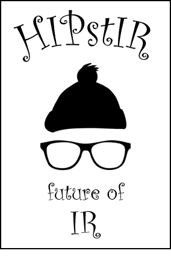
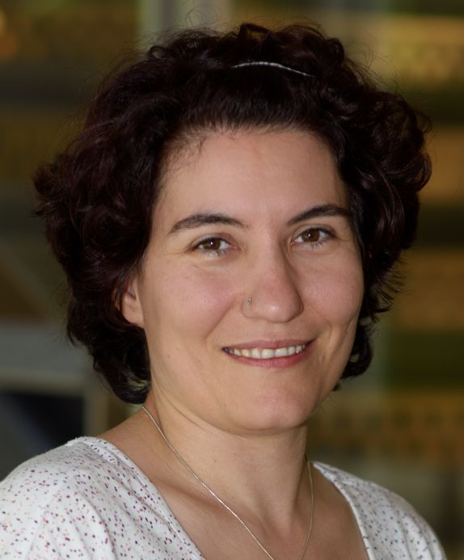
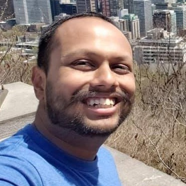

## About

The vision of HIPstIR is that young (at heart) IR researchers getting together to develop a future for non-mainstream ideas and research agendas in information retrieval. Important prior research can be discussed in the form of a reading group. A future vision of what IR should or could be (and how it will get there) will be developed. It is like [SWIRL](https://sites.google.com/view/swirl3/home) in spirit, but focusing on topics that might otherwise be considered "niche", "alternative", "indie", or "left field". 

An explicit goal of the retreat is to foment collaboration and cross-group fertilization. The hope is that participation will give rise to conference workshop topics and joint paper projects.

We primarily focus on young researchers that are anywhere between defending their PhD within 1 year until 1 year into being a tenured professor / senior scientist. We will only invite few senior people.

This is a casual event which is nevertheless intended to be productive and purposeful. No slide presentations are allowed, but a stick and sand will be provided. Attendence will be by invitation. But we are a welcoming bunch--so if you are curious and keen to attend but haven't been invited then drop us a note and we will try our best to accomodate you.

**To those attending, remember you were at HIPstIR before it was cool to do so.**

### Location and dates

HIPstIR 2019 will take place in **Portsmouth, New Hampshire** on **September 20-22 (Friday to Sunday)**.

#### What // when // where:
- **Thursday**
  - **Pre-event social** (for those arriving early) // When: 4 PM // Where: [Loaded Question microbrewery](https://www.loadedquestionbrewing.com) (tentative)
- **Friday**
  - **Welcome session** // When: 4 PM // Where: [Book & Bar](http://www.bookandbar.com) or [The Decks](https://www.goportsmouthnh.com/what-to-do/water/)
  - **Dinner** // When: __ // Where: __ 
- **Saturday**
  - **Morning session** // When: 10 AM // Where: Beach house, Rye
  - **Lunch** // When: __ // Where: __
  - **Evening session** // When: __ // Where: __
  - **Dinner** // When: __ // Where: __
- **Sunday**
  - **Morning session** // When: 10 AM // Where: [Book & Bar](http://www.bookandbar.com) or [The Decks](https://www.goportsmouthnh.com/what-to-do/water/)

### Attendees

- Sandeep Avula
- Asia Biega
- Adrian Boteanu
- Jeff Dalton
- Laura Dietz
- Shiri Dori-Hacohen
- John Foley
- Henry Feild
- Sumanta Kashyapi
- Widad Machmouchi
- Bhaskar Mitra
- Matthew Mitsui
- Steve Nole
- Alexandre Tachard Passos
- Jeremy Pickens
- Jordan Ramsdell
- David Smith
- Alessandro Sordoni
- Andrew Yates

### (Dis)organizing committee

<table border="0" align="center">
<tr>
<td></td><td></td><td></td>
</tr><tr>
<td><a href="http://www.cs.unh.edu/~dietz/">Laura Dietz</a></td><td><a href="https://www.microsoft.com/en-us/research/people/bmitra/">Bhaskar Mitra</a></td><td><a href="https://catalystsecure.com/blog/author/jeremy-pickens/">Jeremy Pickens</a></td>
</tr><tr>
<td>University of New Hampshire</td><td>Microsoft, University College London</td><td>OpenText</td>
</tr>
</table>

### Acknowledgments
We thank ACM SIGIR, Microsoft, and The University of New Hampshire for financial and logistical support for this event.

Any opinions, findings, and conclusions or recommendations expressed in this material are those of the presenter(s) and do not necessarily reflect the views of the sponsors.
