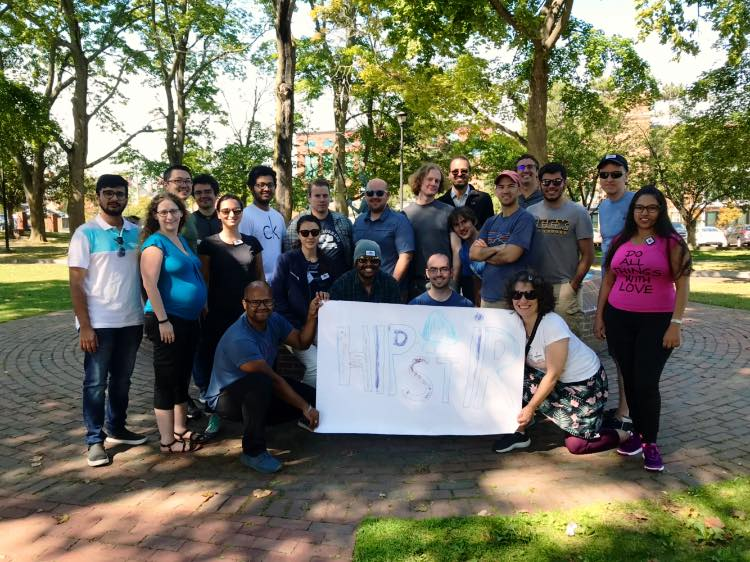
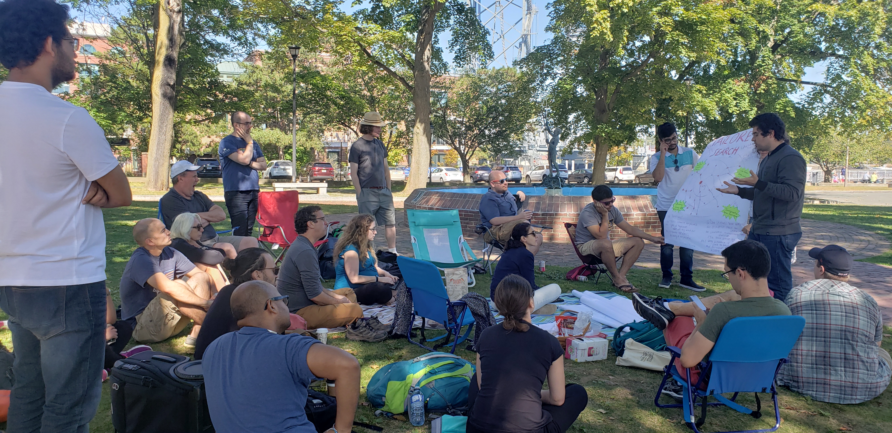
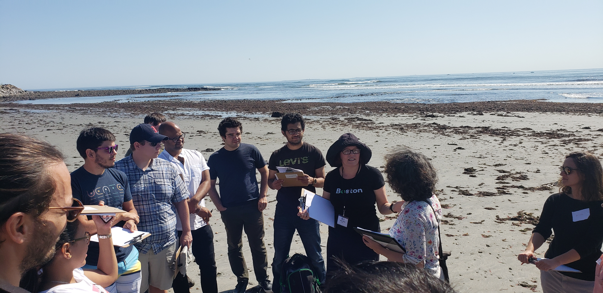
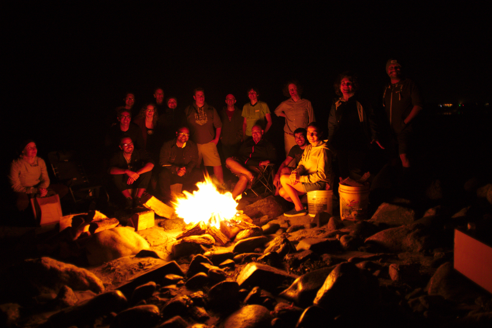

## About

The vision of HIPstIR is that young (at heart) IR researchers getting together to develop a future for non-mainstream ideas and research agendas in information retrieval. Important prior research can be discussed in the form of a reading group. A future vision of what IR should or could be (and how it will get there) will be developed. It is like [SWIRL](https://sites.google.com/view/swirl3/home) in spirit but focusing on topics that might otherwise be considered "niche", "alternative", "indie", or "left field".

An explicit goal of the retreat is to foment collaboration and cross-group fertilization. The hope is that participation will give rise to conference workshop topics and joint paper projects.

We primarily focus on young researchers that are anywhere between defending their PhD within 1 year until 1 year into being a tenured professor / senior scientist. We will only invite few senior people.

This is a casual event which is nevertheless intended to be productive and purposeful. No slide presentations are allowed, but a stick and sand will be provided. Attendance will be by invitation. But we are a welcoming bunch--so if you are curious and keen to attend but haven't been invited then drop us a note and we will try our best to accommodate you.

**To those who attended, remember you were at HIPstIR before it was cool to do so.**

### Event photos

<table border="0" align="center">
  <tr>
    <td></td>
  </tr>
  <tr>
    <td></td>
    <td></td>
    <td></td>
  </tr>
</table>

### Location and dates

HIPstIR 2019 will take place in **Portsmouth, New Hampshire** on **September 20-22 (Friday to Sunday)**.

#### What // When // Where:
- **Thursday**
  - **Pre-pre event arrival** // Notes: if you arrive before 4PM, please go to Laura's home (address is in handbook); do _not_ go to Middle St.
  - **Pre-event social** (for those arriving early) // When: 4 PM // Where: [Loaded Question microbrewery](https://www.loadedquestionbrewing.com) (address: [909 Islington St Suite #12, Portsmouth, NH 03801](https://goo.gl/maps/Xri2EivnLeiq4uB18)) // Notes: find "Dow’s Automotive"--there is a hand-rail entrance to the left
  - **Dinner** // When: TBD // Where: [STREET eat/drink 360](https://www.streetfood360.com/) (address: [801 Islington St, Portsmouth, NH 03801](https://goo.gl/maps/p5y1NF8mt3YtZHgS7)) // Notes: the plan is tentative and will be confirmed soon
- **Friday**
  - **Breakfast** (for those who arrive on Thursday) // When: 10 AM // Where: [Colby's](https://colbysportsmouthnh.com) (address: [105 Daniel St, Portsmouth, NH 03801](https://goo.gl/maps/YVeTkCH2b9LjLRoY9)) // Notes: we may gather at [Kaffee vonsolln](https://www.kaffeevonsolln.com) (address: [79 Daniel St, Portsmouth, NH 03801](https://goo.gl/maps/1E1WaigbiD7MkmhQ9)) till our table is ready; post-breakfast we will focus on planning for the next couple of days (everyone is welcome to participate), rehash some of the SWIRL III reports, read the pre-submitted pitches, etc.
  - **Welcome session** // When: 4 PM // Where: [Book & Bar](http://www.bookandbar.com) (address: [40 Pleasant St, Portsmouth, NH 03801](https://goo.gl/maps/xtgpaY2rWPSsxkc6A)) // Notes: doesn't take reservations, we need to grab a table
  - **Pre-dinner drinks** (optional) // Where: [The Riverhouse restaurant](https://riverhouse53bow.com/) (address: [53 Bow St, Portsmouth, NH 03801](https://goo.gl/maps/DvjkNvNR16KWpnup9)) // Notes: downstairs "at the decks", not the restaurant area
  - **Dinner** // When: 7 PM // Where: [Portsmouth Brewery](https://portsmouthbrewery.com/) (address: [56 Market St, Portsmouth, NH 03801](https://goo.gl/maps/7ueM1Vrcd3Npy1tK7)) // Notes: reservation is under the name "Hipstir"
  - **Night cap** // When: after dinner // Where: [Earth Eagle microbrewery](https://www.eartheaglebrewings.com) (address: [165 High St, Portsmouth, NH 03801](https://goo.gl/maps/4ad4pphqaKbWMeJf6))
- **Saturday**
  - **All day session** // When: 10 AM // Where: Beach house (Address: [1505 Ocean Blvd, Rye, NH 03870](https://goo.gl/maps/3CE1CjUWSTonoKDa8)) // Notes: location is at the corner of Washington Rd. and Ocean Blvd., which is also called Route 1A)
  - ~~**Banquette**~~ **Beachquette** (sponsored by Microsoft and ACM SIGIR) // When: 7 PM (tentative) // Where: Beach house (Address: [1505 Ocean Blvd, Rye, NH 03870](https://goo.gl/maps/3CE1CjUWSTonoKDa8))
- **Sunday**
  - **Half day session** // When: 10 AM // Where: [Book & Bar](http://www.bookandbar.com) (address: [40 Pleasant St, Portsmouth, NH 03801](https://goo.gl/maps/xtgpaY2rWPSsxkc6A)) // Notes: doesn't take reservations, we need to go grab a table
  - **Afternoon session** // Notes: finish discussions and writeups; Explore Portsmouth (Escape room); Lunch and Dinner plans will be announced

### Attendees

- Hana Anber (University of New Hampshire)
- Sandeep Avula (University of North Carolina)
- Asia Biega (Microsoft)
- Adrian Boteanu (Amazon)
- Shubham Chatterjee (University of New Hampshire)
- Jeff Dalton (University of Glasgow)
- Laura Dietz (University of New Hampshire)
- Shiri Dori-Hacohen (AuCoDe)
- John Foley (Smith College)
- Henry Feild (Endicott College)
- Rosie Jones (Spotify)
- Pallika Kanani (Oracle)
- Sumanta Kashyapi (University of New Hampshire)
- Widad Machmouchi (Microsoft)
- Bhaskar Mitra (Microsoft)
- Matthew Mitsui (Rutgers University)
- Steve Nole
- Alexandre Tachard Passos (Google)
- Jeremy Pickens (OpenText)
- Jordan Ramsdell (University of New Hampshire)
- Adam Roegiest (Kira Systems)
- David Smith (Northeastern University)
- Alessandro Sordoni (Microsoft)

### (Dis)organizing committee

<table border="0" align="center">
<tr>
<td></td><td></td><td></td>
</tr><tr>
<td><a href="http://www.cs.unh.edu/~dietz/">Laura Dietz</a></td><td><a href="https://www.microsoft.com/en-us/research/people/bmitra/">Bhaskar Mitra</a></td><td><a href="https://catalystsecure.com/blog/author/jeremy-pickens/">Jeremy Pickens</a></td>
</tr><tr>
<td>University of New Hampshire</td><td>Microsoft & University College London</td><td>OpenText</td>
</tr>
</table>

### Code of conduct

HIPstIR is dedicated to providing a safe space and an inclusive environment for respectful exchange of ideas where every voice is heard and diversity is celebrated. **We will strictly not tolerate any behavior deemed abusive, discriminatory, or harassment**. As a general guideline, please refer to [ACM's anti-harassment policy](https://www.acm.org/special-interest-groups/volunteer-resources/officers-manual/policy-against-discrimination-and-harassment).

### Acknowledgments
We thank ACM SIGIR, Microsoft, and The University of New Hampshire for financial and logistical support for this event.

Any opinions, findings, and conclusions or recommendations expressed in this material are those of the presenter(s) and do not necessarily reflect the views of the sponsors.
